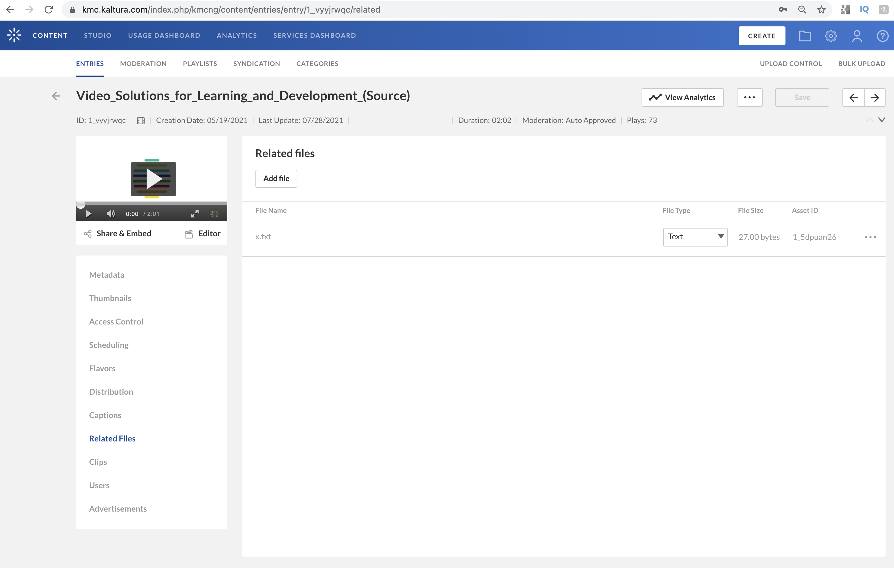
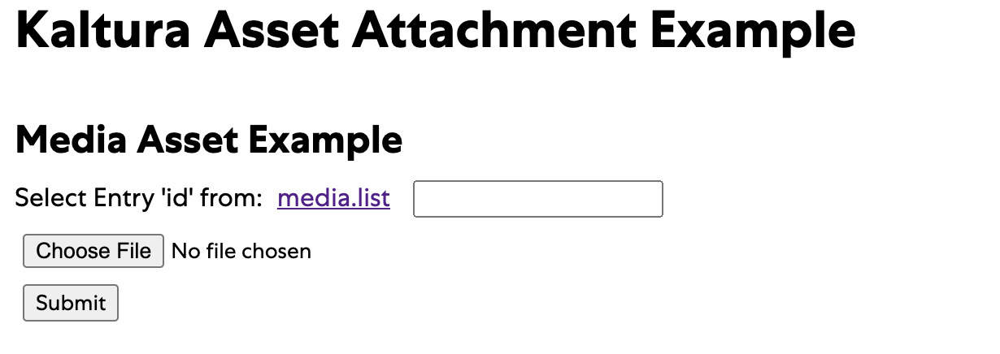

# Non-Media Attachments in the Kaltura API
Examples for creating, uploading and serving non media files in the Kaltura API

An [attachmentAsset](https://developer.kaltura.com/console/service/attachmentAsset) associates a file with an existing [mediaEntry](https://developer.kaltura.com/console/service/media)

And a [dataEntry](https://developer.kaltura.com/console/service/data) is a standalone object for storing and serving files. 

# How to Run
1. Copy env.template to .env and fill in your information
2. run npm install
3. npm run dev for developement
4. npm start for production

# Documentation

## Attachment Asset

An [attachmentAsset](https://developer.kaltura.com/console/service/attachmentAsset) is an object that is associated with a given [mediaEntry](https://developer.kaltura.com/console/service/media)

In the [KMC](https://kmc.kaltura.com/index.php/kmcng/content/entries/list) attachmentAssets are viewable in the "Related Files" tab of "Entries" The Kaltura system uses attachmentAssets for items like storing captions for a mediaEntry. The API also allows you to store your own files associated with a mediaEntry.




In the demo app, the first section handles attachmentAssets:



First, you will need to select an `id` from one of your entries at https://developer.kaltura.com/console/service/media/action/list

Then choose a file and submit the form. Control is handled by [index.js](https://github.com/kaltura-vpaas/non-media-documents-demo/blob/master/routes/index.js#L24) which passes the form's data to [attachmentAssetExample.js](https://github.com/kaltura-vpaas/non-media-documents-demo/blob/master/lib/attachmentAssetExample.js)

The first step in uploading most content to the Kaltura API is using the [uploadToken flow](https://developer.kaltura.com/workflows/Ingest_and_Upload_Media) and this approach is used [here](https://github.com/kaltura-vpaas/non-media-documents-demo/blob/master/lib/attachmentAssetExample.js#L5)

```javascript
async function createAndUploadAsset(client, entryId, fileName, fileData) {
	  let uploadToken = new kaltura.objects.UploadToken();
    let upToken = await kaltura.services.uploadToken.add(uploadToken)
        .execute(client)
        .then(result => {
            console.log(result);
            return result;
        });

    let resume = false;
    let finalChunk = true;
    let resumeAt = -1;

    let uploaded = await kaltura.services.uploadToken.upload(upToken.id, fileData, resume, finalChunk, resumeAt)
        .execute(client)
        .then(result => {
            console.log(result);
            return result;
        });
```

after this code has run, the file has already been uploaded to the [uploadToken](https://developer.kaltura.com/console/service/uploadToken) that was just created. 

Next, an [attachmentAsset](https://developer.kaltura.com/console/service/attachmentAsset) is created

```javascript
    let attachmentAsset = new kaltura.objects.AttachmentAsset();
    attachmentAsset.format = kaltura.enums.AttachmentType.TEXT;
    attachmentAsset.filename = fileName
    attachmentAsset.title = "title";
```

The following types are [available](https://developer.kaltura.com/api-docs/General_Objects/Objects/KalturaAttachmentAsset). This example is hardcoded, but be sure to assign the correct type as it will affect the `Content-Type` header of the asset when it is served:

```
TEXT [1], MEDIA [2], DOCUMENT [3], JSON [4]
```

At this point, none of the objects (`entryId`, `uploadToken`, `attachmentAsset`) are associated with each other.

The final step is to associate them with each other:

```javascript
    // https://developer.kaltura.com/console/service/attachmentAsset/action/add
    return await kaltura.services.attachmentAsset.add(entryId, attachmentAsset)
        .execute(client)
        .then(result => {
            console.log(result);
            let contentResource = new kaltura.objects.UploadedFileTokenResource();
            contentResource.token = upToken.id;
            // https://developer.kaltura.com/console/service/attachmentAsset
            return kaltura.services.attachmentAsset.setContent(result.id, contentResource)
                .execute(client)
                .then(result => {
                    console.log(result);
                    return result;
```

Two API calls happen here. First, [attachmentAsset.add](https://developer.kaltura.com/console/service/attachmentAsset/action/add) is called with the `entryId` supplied by the user and the newly created `attachmentAsset` object which only existed client side in the demo app. After this call, the `attachmentAsset` exists server side and its `id`  is used to associate it with the `uploadToken` in the next call: 

```javascript
   					let contentResource = new kaltura.objects.UploadedFileTokenResource();
            contentResource.token = upToken.id;
            // https://developer.kaltura.com/console/service/attachmentAsset
            return kaltura.services.attachmentAsset.setContent(result.id, contentResource)
```

Now all of the objects are associate with each other and ready to be used or persisted. In this example, the `json` result from the [attachmentAsset.setContent](https://developer.kaltura.com/console/service/attachmentAsset/action/setContent) call is returned to the browser to be displayed to the user: 

```json
{
  "filename": "x.txt",
  "title": "title",
  "format": "1",
  "status": 2,
  "id": "1_gbkrguox",
  "entryId": "1_zuv81cf9",
  "partnerId": 12345,
  "version": "1",
  "size": 27,
  "tags": "",
  "fileExt": "noex",
  "createdAt": 1627518774,
  "updatedAt": 1627518775,
  "description": "",
  "sizeInBytes": "27",
  "objectType": "KalturaAttachmentAsset"
}
```

At this point, you may want to [serve](https://developer.kaltura.com/console/service/attachmentAsset/action/serve) the asset directly, or [list](https://developer.kaltura.com/console/service/attachmentAsset/action/list) all of the assets for a given `entryId` 

Here is the [full list](https://developer.kaltura.com/console/service/attachmentAsset) of api calls related to `attachmentAsset`

- [attachmentAsset.add](https://developer.kaltura.com/console/service/attachmentAsset/action/add)
- [attachmentAsset.delete](https://developer.kaltura.com/console/service/attachmentAsset/action/delete)
- [attachmentAsset.get](https://developer.kaltura.com/console/service/attachmentAsset/action/get)
- [attachmentAsset.getRemotePaths](https://developer.kaltura.com/console/service/attachmentAsset/action/getRemotePaths)
- [attachmentAsset.getUrl](https://developer.kaltura.com/console/service/attachmentAsset/action/getUrl)
- [attachmentAsset.list](https://developer.kaltura.com/console/service/attachmentAsset/action/list)
- [attachmentAsset.serve](https://developer.kaltura.com/console/service/attachmentAsset/action/serve)
- [attachmentAsset.setContent](https://developer.kaltura.com/console/service/attachmentAsset/action/setContent)
- [attachmentAsset.update](https://developer.kaltura.com/console/service/attachmentAsset/action/update)


## Standalone Data Entry

Kaltura's API also has the ability to accept any type of file via a [dataEntry](https://developer.kaltura.com/console/service/data) unlike the previous example, a `dataEntry` is not associated with a `mediaEntry` and there is no UI in the KMC to view these files. It is up to you to implement a user interface to access, edit and serve a `dataEntry`

In the example, use the second form to upload a file and create a `dataEntry`:


Control is handled by [index.js](https://github.com/kaltura-vpaas/non-media-documents-demo/blob/master/routes/index.js#L33) which passes the form's data to [dataEntryExample.js](https://github.com/kaltura-vpaas/non-media-documents-demo/blob/master/lib/dataEntryExample.js) 

Exactly like the previous example, the first step in uploading most content to the Kaltura API is using the [uploadToken flow](https://developer.kaltura.com/workflows/Ingest_and_Upload_Media) and this approach is used here:

```javascript
async function createAndUploadAsset(client, entryId, fileName, fileData) {
	  let uploadToken = new kaltura.objects.UploadToken();
    let upToken = await kaltura.services.uploadToken.add(uploadToken)
        .execute(client)
        .then(result => {
            console.log(result);
            return result;
        });

    let resume = false;
    let finalChunk = true;
    let resumeAt = -1;

    let uploaded = await kaltura.services.uploadToken.upload(upToken.id, fileData, resume, finalChunk, resumeAt)
        .execute(client)
        .then(result => {
            console.log(result);
            return result;
        });
```

after this code has run, the file has already been uploaded to the [uploadToken](https://developer.kaltura.com/console/service/uploadToken) that was just created. 

Next a dataEntry is created:

```javascript
    let dataEntry = new kaltura.objects.DataEntry();
    dataEntry.type = kaltura.enums.EntryType.DATA;

    let newDataEntry = await kaltura.services.data.add(dataEntry)
        .execute(client)
        .then(result => {
            console.log(result);
            return result;
        });
```

While only the minimal configuration is provided for this example, there are many options to configure a dataEntry at this point via the same call used in this step [data.add](https://developer.kaltura.com/console/service/data/action/add)

Finally, the`dataEntry` is associated with the file uploaded previously and stored via `uploadToken` 

```javascript
    let resource = new kaltura.objects.UploadedFileTokenResource();
    resource.token = upToken.id;

    return await kaltura.services.data.addContent(newDataEntry.id, resource)
        .execute(client)
        .then(result => {
            console.log(result);
            return result;
        });
```

The example displays the json returned by [data.addContent](https://developer.kaltura.com/console/service/data/action/addContent) :

```
{
  "dataContent": "lkajsldjkalkjd 10923019283\n",
  "retrieveDataContentByGet": 1,
  "id": "1_foayvsc5",
  "partnerId": 12345,
  "userId": "",
  "creatorId": "",
  "status": 2,
  "moderationStatus": 6,
  "moderationCount": 0,
  "type": 6,
  "createdAt": 1627520973,
  "updatedAt": 1627520973,
  "rank": 0,
  "totalRank": 0,
  "votes": 0,
  "downloadUrl": "https://cfvod.kaltura.com/p/12345/sp/12345/raw/entry_id/1_foayvsc5/version/100001",
  "searchText": "_PAR_ONLY_ _3033241_ _MEDIA_TYPE_-1|  ",
  "version": "100001",
  "thumbnailUrl": "https://cfvod.kaltura.com/p/12345/sp/12345/thumbnail/entry_id/1_foayvsc5/version/0",
  "accessControlId": 3557861,
  "replacementStatus": 0,
  "partnerSortValue": 0,
  "rootEntryId": "1_foayvsc5",
  "operationAttributes": [],
  "entitledUsersEdit": "",
  "entitledUsersPublish": "",
  "entitledUsersView": "",
  "capabilities": "",
  "displayInSearch": 1,
  "blockAutoTranscript": false,
  "objectType": "KalturaDataEntry"
}
```

At this point, you may want to [serve](https://developer.kaltura.com/console/service/data/action/serve) the asset directly, or [list](https://developer.kaltura.com/console/service/data/action/list) all of the assets for a given `dataEntry` 

Here is the [full list](https://developer.kaltura.com/console/service/data) of api calls related to `dataEntry`

- [data.add](https://developer.kaltura.com/console/service/data/action/add)
- [data.addContent](https://developer.kaltura.com/console/service/data/action/addContent)
- [data.delete](https://developer.kaltura.com/console/service/data/action/delete)
- [data.get](https://developer.kaltura.com/console/service/data/action/get)
- [data.list](https://developer.kaltura.com/console/service/data/action/list)
- [data.serve](https://developer.kaltura.com/console/service/data/action/serve)
- [data.update](https://developer.kaltura.com/console/service/data/action/update)

# How you can help (guidelines for contributors) 

Thank you for helping Kaltura grow! If you'd like to contribute please follow these steps:
* Use the repository issues tracker to report bugs or feature requests
* Read [Contributing Code to the Kaltura Platform](https://github.com/kaltura/platform-install-packages/blob/master/doc/Contributing-to-the-Kaltura-Platform.md)
* Sign the [Kaltura Contributor License Agreement](https://agentcontribs.kaltura.org/)

# Where to get help
* Join the [Kaltura Community Forums](https://forum.kaltura.org/) to ask questions or start discussions
* Read the [Code of conduct](https://forum.kaltura.org/faq) and be patient and respectful

# Get in touch
You can learn more about Kaltura and start a free trial at: http://corp.kaltura.com    
Contact us via Twitter [@Kaltura](https://twitter.com/Kaltura) or email: community@kaltura.com  
We'd love to hear from you!

# License and Copyright Information
All code in this project is released under the [AGPLv3 license](http://www.gnu.org/licenses/agpl-3.0.html) unless a different license for a particular library is specified in the applicable library path.   

Copyright © Kaltura Inc. All rights reserved.   
Authors and contributors: See [GitHub contributors list](https://github.com/kaltura/YOURREPONAME/graphs/contributors).  

### Open Source Libraries Used
